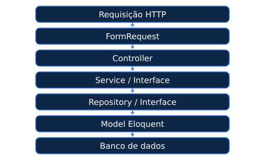
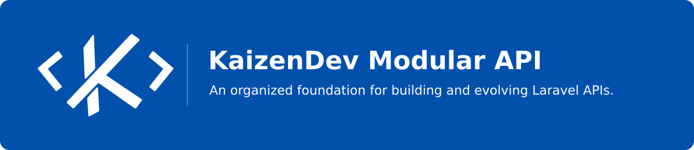
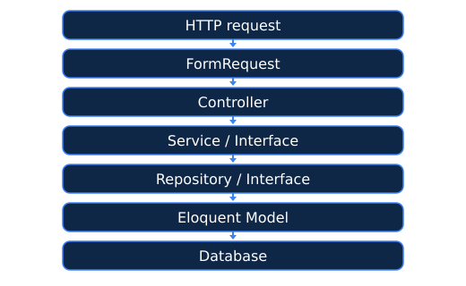

<a id="portugues" name="portugues"></a>

<p align="right">
  <a href="#portugues">🇧🇷 Português</a> ·
  <a href="#english">🇺🇸 English</a>
</p>

<div align="center">
  <a href="https://kaizen.dev.br">
    
  </a>

  <p>Monolito modular · Geração de código · Convenções compartilhadas</p>

  <p>
    
    
    <a href="https://github.com/KaizenDevBr/laravel-modular-api"></a>
    
  </p>

  <p>
    <a href="#instalacao">Instalação</a> ·
    <a href="#arquitetura">Arquitetura</a> ·
    <a href="#contato">Contato</a>
  </p>
</div>

---

## 🇧🇷 APIs organizadas por domínio

O **KaizenDev Modular API** é um pacote de scaffolding para aplicações Laravel. Ele organiza o código em módulos de negócio dentro de `app/Http/Modules`, com uma base compartilhada e separação entre entrada HTTP, regras de negócio e acesso a dados.

A proposta é dar um ponto de partida consistente para o projeto: cada módulo reúne suas classes, enquanto o Laravel continua sendo responsável pela execução da aplicação. Você gera a estrutura e adapta o código às necessidades do seu domínio.

### O que o pacote entrega

| Recurso | Na prática |
| --- | --- |
| **Instalação interativa** | Publica a base da arquitetura e permite escolher os arquivos de apoio em português ou inglês. |
| **Gerador de módulos** | Cria controllers, models, services, repositories, interfaces e arquivos auxiliares com um comando. |
| **Providers por módulo** | Descobre e registra os providers de serviços e repositórios seguindo as convenções de nomes. |
| **Migrations por módulo** | Carrega as migrations de cada módulo para os comandos Artisan do Laravel. |
| **Base compartilhada** | Fornece classes base e helpers para respostas JSON com `success`, `message`, `data` e `status`. |
| **Código na aplicação** | Publica os arquivos base no seu projeto para que você possa ler, adaptar e versionar. |

> [!NOTE]
> A organização modular pode apoiar uma modelagem orientada a domínio. As regras, os limites e a comunicação entre os módulos são decisões do seu projeto.

<a id="instalacao" name="instalacao"></a>

## Comece por aqui

### 1. Instale o pacote

No diretório de uma aplicação Laravel, execute:

```bash
composer require kaizendev/laravel-modular-api
```

Os requisitos declarados em [composer.json](composer.json) são **PHP `^8.2`** e componentes Illuminate **`^11.0`, `^12.0` ou `^13.0`**. A aplicação também precisa atender aos requisitos da versão do Laravel utilizada.

### 2. Prepare a arquitetura

> [!WARNING]
> Execute o instalador com suas alterações versionadas ou com um backup. A limpeza opcional pode excluir pastas inteiras de models, controllers, requests, resources, jobs e seeders, além de **todos os arquivos diretamente em `database/migrations` e `database/factories`**. As confirmações de exclusão têm **“sim” como padrão**: escolha “não” para preservar o que já existe.

```bash
php artisan modular:install
```

O assistente permite selecionar **Português do Brasil** ou **English (US)** e:

1. Publica o módulo `Base` em `app/Http/Modules/Base`.
2. Copia o `ModuleServiceProvider` para `app/Providers` e o registra em `bootstrap/providers.php`, quando esse arquivo existe.
3. Publica o guia `KAIZENDEV.md` na raiz da aplicação.
4. Pergunta quais partes da estrutura padrão você deseja remover.

<details>
<summary><strong>Vai instalar em um projeto existente ou executar novamente?</strong></summary>

O instalador copia os arquivos base, o provider e a documentação para a aplicação. Uma nova execução pode sobrescrever personalizações nesses arquivos.

Revise as mudanças antes de continuar e preserve pastas usadas por autenticação, rotas ou outras funcionalidades existentes. A limpeza de migrations e factories não distingue arquivos padrão de arquivos criados por você.

</details>

### 3. Crie um módulo de negócio

```bash
php artisan make:module Produto --table=produtos
```

O exemplo cria `app/Http/Modules/Produto` e uma migration para a tabela `produtos`.

Você também pode informar apenas o nome:

```bash
php artisan make:module Produto
```

Nesse caso, o comando pergunta se o módulo será vinculado a uma tabela e qual será o nome dela. Se você optar por não vincular uma tabela, nenhuma migration será gerada; ajuste os placeholders de tabela antes de usar a persistência.

> [!IMPORTANT]
> O gerador cria uma estrutura inicial. Antes de expor os endpoints, configure as rotas, a autorização, as regras dos requests e os campos do domínio. Se o módulo já existir e você confirmar a sobrescrita, sua pasta será excluída e recriada.

### 4. Adapte e conecte à aplicação

- Defina as colunas da migration, os casts do model e as regras de validação.
- Implemente as regras de negócio no service e ajuste a persistência no repository.
- Registre as rotas no arquivo de rotas da sua aplicação.
- Revise a migration e aplique-a ao banco configurado.

Por exemplo, em `routes/api.php`, caso esse arquivo esteja configurado na aplicação:

```php
use App\Http\Modules\Produto\Controllers\ProdutoController;
use Illuminate\Support\Facades\Route;

Route::apiResource('produtos', ProdutoController::class);
```

Depois de ajustar a migration:

```bash
php artisan migrate
```

<a id="arquitetura" name="arquitetura"></a>

## Como as camadas se conectam

<p align="center">
  
</p>

| Camada | Responsabilidade |
| --- | --- |
| **Request** | Autorizar e validar a entrada conforme as regras que você definir. |
| **Controller** | Receber a requisição, chamar o service e construir a resposta. |
| **Service** | Organizar as regras de negócio e coordenar operações. |
| **Repository** | Concentrar as consultas e operações de persistência. |
| **Model** | Representar a tabela e configurar casts, relações e comportamento Eloquent. |

O `ModuleServiceProvider` percorre `app/Http/Modules` e registra os providers que seguem os nomes `{Modulo}ServiceProvider` e `{Modulo}RepositoryProvider`. Também carrega as migrations e configura a resolução das factories dos módulos.

> [!TIP]
> Use nomes de módulos que representem o negócio, como `Produto`, `Pedido` ou `Cliente`. Mantenha as convenções geradas para que os providers sejam descobertos automaticamente.

<details>
<summary><strong>Veja a estrutura gerada para o módulo Produto</strong></summary>

```text
app/Http/Modules/
├── Base/
└── Produto/
    ├── Controllers/
    │   └── ProdutoController.php
    ├── Models/
    │   └── Produto.php
    ├── Providers/
    │   ├── ProdutoRepositoryProvider.php
    │   └── ProdutoServiceProvider.php
    ├── Repositories/
    │   ├── Interfaces/ProdutoRepositoryInterface.php
    │   └── ProdutoRepositoryEloquent.php
    ├── Services/
    │   ├── Interfaces/ProdutoServiceInterface.php
    │   └── ProdutoService.php
    ├── Requests/
    │   ├── IndexRequest.php
    │   ├── StoreRequest.php
    │   └── UpdateRequest.php
    ├── Resources/ProdutoResource.php
    ├── Traits/ProdutoTrait.php
    ├── Jobs/ProdutoJob.php
    ├── Migrations/
    │   └── {data}_create_produtos_table.php
    ├── Seeders/ProdutoSeeder.php
    ├── Factories/ProdutoFactory.php
    └── Exports/ProdutoExport.php
```

A migration é criada quando uma tabela é informada. Jobs, resources, factories e seeders incluem estruturas iniciais para você implementar. O export gerado utiliza interfaces do `maatwebsite/excel`; essa dependência precisa estar instalada na aplicação se você usar a classe de exportação.

</details>

<details>
<summary><strong>Perguntas frequentes</strong></summary>

### O pacote registra minhas rotas automaticamente?

Não. O provider registra os providers dos módulos, carrega migrations e configura a resolução de factories. As rotas devem ser definidas na aplicação.

### Criar o módulo já cria a tabela no banco?

Não. O comando gera o arquivo de migration quando há uma tabela informada. Revise as colunas e execute `php artisan migrate` para aplicar as migrations pendentes.

### Como funciona a atribuição em massa no BaseModel?

Por padrão, o `BaseModel` protege `id`, `created_at`, `updated_at` e `deleted_at` com `$guarded`. As demais colunas podem receber atribuição em massa. Revise os campos permitidos para cada operação; os helpers `addGuarded()`, `addFillable()` e `removeGuarded()` estão disponíveis nas instâncias do model.

### Atualizar o pacote atualiza os arquivos publicados?

A atualização via Composer altera o pacote, não os arquivos já copiados para a aplicação. Compare as mudanças antes de incorporá-las. Executar o instalador novamente pode sobrescrever seus arquivos base.

### A escolha de idioma também traduz o gerador?

A seleção define o idioma dos stubs publicados pelo instalador. As mensagens e os templates do `make:module` permanecem conforme implementados no comando, atualmente em português.

</details>

<a id="contato" name="contato"></a>

## Dúvidas, sugestões e contribuições

Encontrou um problema ou tem uma ideia para melhorar o pacote? Abra uma issue neste repositório com o contexto, as versões de PHP e Laravel e, quando possível, um exemplo que permita reproduzir o comportamento.

Para contribuir com código ou documentação, envie um pull request explicando o problema e a mudança proposta.

- **E-mail para dúvidas e sugestões:** [contato@kaizen.dev.br](mailto:contato@kaizen.dev.br)
- **Site:** [kaizen.dev.br](https://kaizen.dev.br)

## Licença

Este pacote declara a licença **MIT** em [composer.json](composer.json).

---

<div align="center">
  <p>
    Desenvolvido por:<br>
    <strong>Wanderson Borges | KaizenDev</strong><br>
    <a href="https://kaizen.dev.br">kaizen.dev.br</a> ·
    <a href="mailto:contato@kaizen.dev.br">contato@kaizen.dev.br</a>
  </p>
  <p><em>Construir. Aprender. Melhorar.</em></p>
</div>

---

<a id="english" name="english"></a>

<p align="right">
  <a href="#portugues">🇧🇷 Português</a> ·
  <a href="#english">🇺🇸 English</a>
</p>

<div align="center">
  <a href="https://kaizen.dev.br">
    
  </a>
  <p>Modular monolith · Code generation · Shared conventions</p>

  <p>
    
    
    <a href="https://github.com/KaizenDevBr/laravel-modular-api"></a>
    
  </p>

  <p>
    <a href="#installation">Installation</a> ·
    <a href="#architecture">Architecture</a> ·
    <a href="#contact">Contact</a>
  </p>
</div>

## 🇺🇸 APIs organized by domain

**KaizenDev Modular API** is a scaffolding package for Laravel applications. It organizes code into business modules inside `app/Http/Modules`, with a shared foundation and separation between HTTP input, business rules and data access.

The goal is to provide a consistent starting point for your project: each module groups its classes, while Laravel remains responsible for running the application. You generate the structure and adapt the code to your domain's needs.

### What the package provides

| Feature | In practice |
| --- | --- |
| **Interactive installation** | Publishes the architectural foundation and lets you choose supporting files in Portuguese or English. |
| **Module generator** | Creates controllers, models, services, repositories, interfaces and supporting files with one command. |
| **Module providers** | Discovers and registers service and repository providers following naming conventions. |
| **Module migrations** | Loads each module's migrations for Laravel's Artisan commands. |
| **Shared foundation** | Provides base classes and helpers for JSON responses with `success`, `message`, `data` and `status`. |
| **Code in your application** | Publishes the base files into your project so you can read, adapt and version them. |

> [!NOTE]
> Modular organization can support domain-oriented modeling. The rules, boundaries and communication between modules are decisions for your project.

<a id="installation" name="installation"></a>

## Getting started

### 1. Install the package

From your Laravel application's directory, run:

```bash
composer require kaizendev/laravel-modular-api
```

The requirements declared in [composer.json](composer.json) are **PHP `^8.2`** and Illuminate components **`^11.0`, `^12.0` or `^13.0`**. Your application must also meet the requirements of the Laravel version it uses.

### 2. Prepare the architecture

> [!WARNING]
> Run the installer with your changes committed to version control or with a backup. Optional cleanup can delete entire models, controllers, requests, resources, jobs and seeders directories, plus **all files directly inside `database/migrations` and `database/factories`**. Deletion prompts default to **yes**: choose **no** to preserve existing files.

```bash
php artisan modular:install
```

The wizard lets you select **Português do Brasil** or **English (US)** and:

1. Publishes the `Base` module into `app/Http/Modules/Base`.
2. Copies `ModuleServiceProvider` into `app/Providers` and registers it in `bootstrap/providers.php` when that file exists.
3. Publishes the `KAIZENDEV.md` guide in the application's root directory.
4. Asks which parts of the default structure you want to remove.

<details>
<summary><strong>Installing in an existing project or running the installer again?</strong></summary>

The installer copies base files, the provider and documentation into your application. Running it again may overwrite customizations in those files.

Review changes before continuing and preserve directories used by authentication, routes or other existing features. Migration and factory cleanup does not distinguish default files from files you created.

</details>

### 3. Create a business module

```bash
php artisan make:module Product --table=products
```

This example creates `app/Http/Modules/Product` and a migration for the `products` table.

You can also provide just the name:

```bash
php artisan make:module Product
```

In that case, the command asks whether the module will be associated with a table and what its name will be. If you choose not to associate a table, no migration is generated; update the table placeholders before using persistence.

> [!IMPORTANT]
> The generator creates an initial structure. Before exposing endpoints, configure routes, authorization, request rules and domain fields. If the module already exists and you confirm the overwrite, its directory will be deleted and recreated.

### 4. Adapt and connect it to your application

- Define migration columns, model casts and validation rules.
- Implement business rules in the service and adjust persistence in the repository.
- Register routes in your application's route file.
- Review the migration and apply it to the configured database.

For example, in `routes/api.php`, if that file is configured in your application:

```php
use App\Http\Modules\Product\Controllers\ProductController;
use Illuminate\Support\Facades\Route;

Route::apiResource('products', ProductController::class);
```

After adjusting the migration:

```bash
php artisan migrate
```

<a id="architecture" name="architecture"></a>

## How the layers connect

<p align="center">
  
</p>

| Layer | Responsibility |
| --- | --- |
| **Request** | Authorize and validate input according to the rules you define. |
| **Controller** | Receive the request, call the service and build the response. |
| **Service** | Organize business rules and coordinate operations. |
| **Repository** | Centralize queries and persistence operations. |
| **Model** | Represent the table and configure casts, relationships and Eloquent behavior. |

`ModuleServiceProvider` scans `app/Http/Modules` and registers providers named `{Module}ServiceProvider` and `{Module}RepositoryProvider`. It also loads migrations and configures factory name resolution for modules.

> [!TIP]
> Use module names that represent the business, such as `Product`, `Order` or `Customer`. Keep the generated conventions so providers are discovered automatically.

<details>
<summary><strong>See the generated structure for the Product module</strong></summary>

```text
app/Http/Modules/
├── Base/
└── Product/
    ├── Controllers/
    │   └── ProductController.php
    ├── Models/
    │   └── Product.php
    ├── Providers/
    │   ├── ProductRepositoryProvider.php
    │   └── ProductServiceProvider.php
    ├── Repositories/
    │   ├── Interfaces/ProductRepositoryInterface.php
    │   └── ProductRepositoryEloquent.php
    ├── Services/
    │   ├── Interfaces/ProductServiceInterface.php
    │   └── ProductService.php
    ├── Requests/
    │   ├── IndexRequest.php
    │   ├── StoreRequest.php
    │   └── UpdateRequest.php
    ├── Resources/ProductResource.php
    ├── Traits/ProductTrait.php
    ├── Jobs/ProductJob.php
    ├── Migrations/
    │   └── {date}_create_products_table.php
    ├── Seeders/ProductSeeder.php
    ├── Factories/ProductFactory.php
    └── Exports/ProductExport.php
```

A migration is created when a table is provided. Jobs, resources, factories and seeders include initial structures for you to implement. The generated export uses interfaces from `maatwebsite/excel`; that dependency must be installed in your application if you use the export class.

</details>

<details>
<summary><strong>Frequently asked questions</strong></summary>

### Does the package register my routes automatically?

No. The provider registers module providers, loads migrations and configures factory name resolution. Routes must be defined in your application.

### Does creating a module also create the database table?

No. The command generates a migration file when a table is provided. Review the columns and run `php artisan migrate` to apply pending migrations.

### How does mass assignment work in BaseModel?

By default, `BaseModel` protects `id`, `created_at`, `updated_at` and `deleted_at` through `$guarded`. Other columns can receive mass assignment. Review the fields allowed for each operation; the `addGuarded()`, `addFillable()` and `removeGuarded()` helpers are available on model instances.

### Does updating the package update published files?

A Composer update changes the package, not the files already copied into your application. Compare changes before incorporating them. Running the installer again may overwrite your base files.

### Does the language selection also translate the generator?

The selection sets the language of the stubs published by the installer. The messages and templates of `make:module` remain as implemented in the command, currently in Portuguese.

</details>

<a id="contact" name="contact"></a>

## Questions, suggestions and contributions

Found a problem or have an idea to improve the package? Open an issue in this repository with context, your PHP and Laravel versions and, when possible, an example that reproduces the behavior.

To contribute code or documentation, submit a pull request explaining the problem and the proposed change.

- **Email for questions and suggestions:** [contato@kaizen.dev.br](mailto:contato@kaizen.dev.br)
- **Website:** [kaizen.dev.br](https://kaizen.dev.br)

## License

This package declares the **MIT** license in [composer.json](composer.json).

---

<div align="center">
  <p>
    Developed by:<br>
    <strong>Wanderson Borges | KaizenDev</strong><br>
    <a href="https://kaizen.dev.br">kaizen.dev.br</a> ·
    <a href="mailto:contato@kaizen.dev.br">contato@kaizen.dev.br</a>
  </p>
  <p><em>Build. Learn. Improve.</em></p>
</div>
